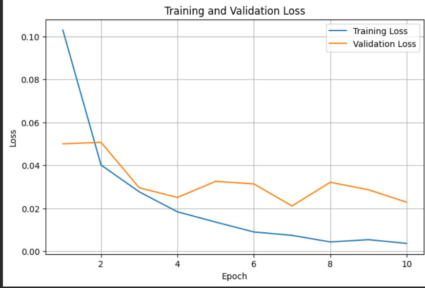
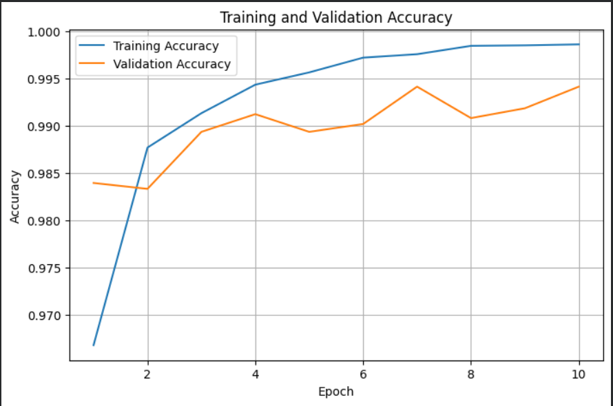
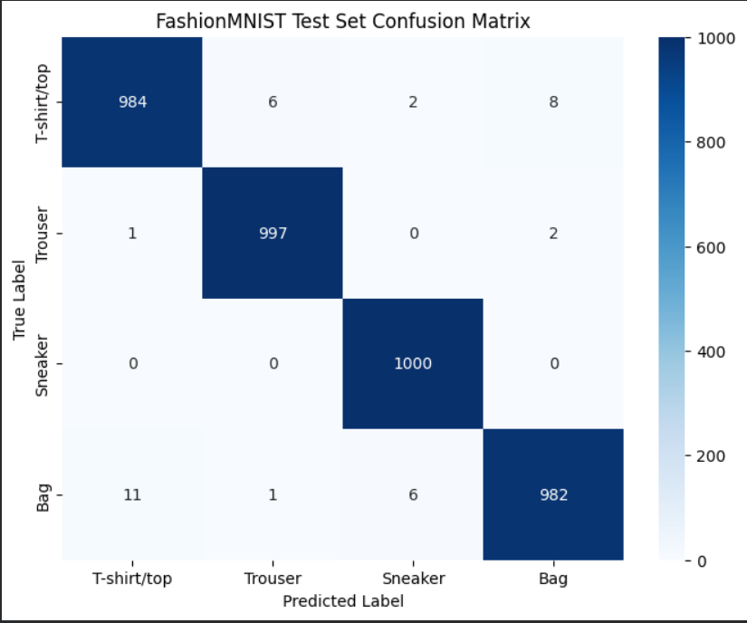
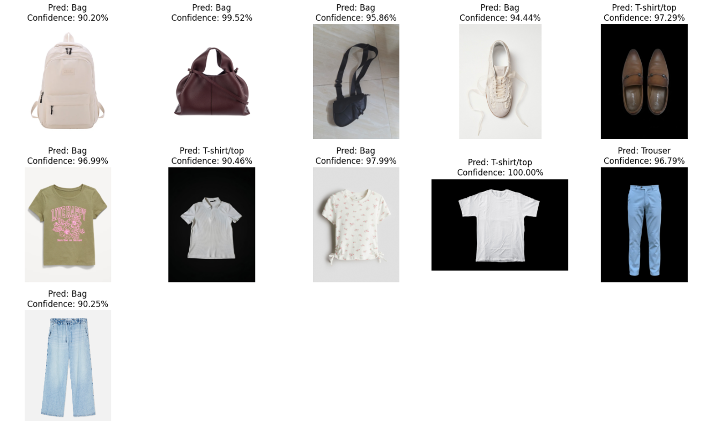
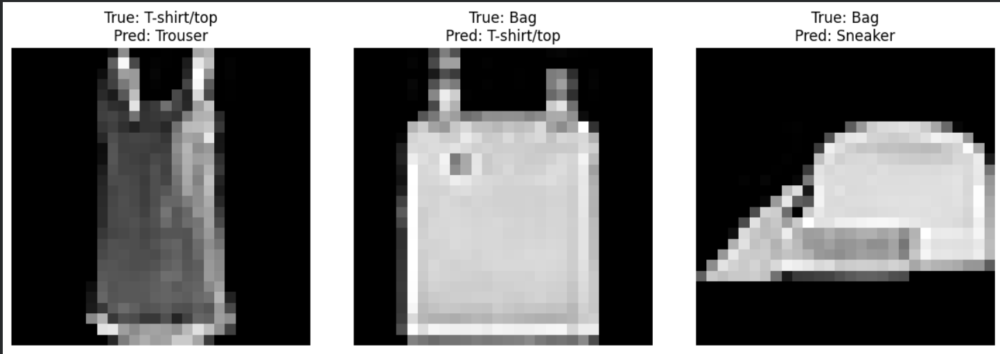

## Custom Phone Image Results

The trained CNN was tested on 11 custom smartphone images containing real-world objects from the four selected classes.

| Image | Predicted Class | Confidence |
|---|---|---:|
| bag2.jpg | Bag | 66.56% |
| bag3.jpg | Bag | 80.68% |
| bag7.jpeg | Bag | 60.50% |
| sneaker3.jpg | Bag | 82.22% |
| sneaker9.jpeg | Bag | 95.20% |
| top1.jpg | T-shirt/top | 50.48% |
| top10.jpeg | Bag | 76.74% |
| top3.jpg | Bag | 87.17% |
| top4.jpg | T-shirt/top | 99.96% |
| touser10.jpeg | Trouser | 99.97% |
| trouser3.jpg | Bag | 73.90% |

## Results

### Standard Test Set Performance

**Standard test set accuracy: 99.08% (3963 / 4000)**

| **Class** | **Precision** | **Recall** | **F1-score** | **Support** |
|---|---:|---:|---:|---:|
| T-shirt/top | 0.9880 | 0.9840 | 0.9860 | 1000 |
| Trouser | 0.9930 | 0.9970 | 0.9950 | 1000 |
| Sneaker | 0.9921 | 1.0000 | 0.9960 | 1000 |
| Bag | 0.9899 | 0.9820 | 0.9859 | 1000 |
| **Accuracy** | | | **0.9908** | **4000** |
| **Macro Avg** | **0.9907** | **0.9908** | **0.9907** | **4000** |
| **Weighted Avg** | **0.9907** | **0.9908** | **0.9907** | **4000** |

### Training and Validation Loss



### Training and Validation Accuracy



### Confusion Matrix



### Custom Smartphone Predictions



### Visual Error Analysis



## CNN Architecture

The Convolutional Neural Network (CNN) is implemented using PyTorch and inherits from `nn.Module`.

### Architecture

```text
Input Image
(1 × 28 × 28)
      │
      ▼
Conv2D
      │
      ▼
ReLU
      │
      ▼
MaxPool2D
      │
      ▼
Conv2D
      │
      ▼
ReLU
      │
      ▼
MaxPool2D
      │
      ▼
Flatten
      │
      ▼
Fully Connected (Linear)
      │
      ▼
ReLU
      │
      ▼
Fully Connected (Linear)
      │
      ▼
Output
(4 Classes)
      │
      ├── T-shirt/top
      ├── Trouser
      ├── Sneaker
      └── Bag
